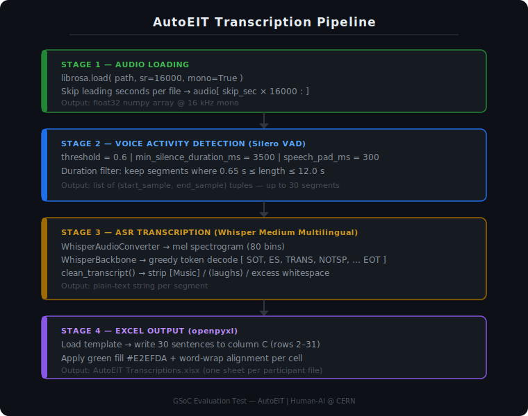
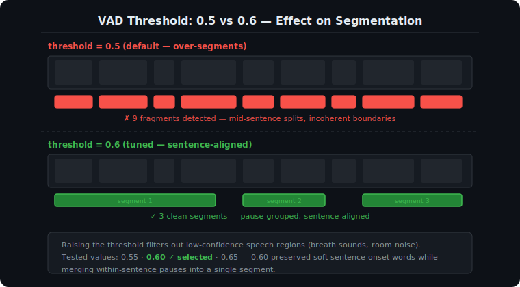
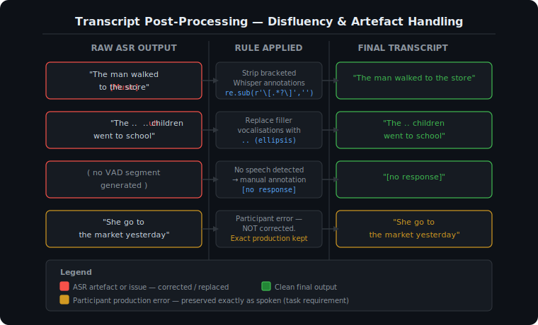

# AutoEIT Audio Transcription Pipeline
### GSoC Evaluation Test — Human-AI @ CERN

---

## Table of Contents

1. [Project Overview](#1-project-overview)
2. [Task Description](#2-task-description)
3. [Approach & Pipeline Architecture](#3-approach--pipeline-architecture)
4. [Technology Stack](#4-technology-stack)
5. [Pipeline Walkthrough](#5-pipeline-walkthrough)
6. [Challenges, Problems & Solutions](#6-challenges-problems--solutions)
7. [Evaluation Methodology](#7-evaluation-methodology)
8. [Output Format](#8-output-format)
9. [How to Run](#9-how-to-run)
10. [File Structure](#10-file-structure)

---



---

## 1. Project Overview

This project implements an automated speech recognition (ASR) pipeline for the **AutoEIT (Automatic English Identification Test)** task under the **Human-AI @ CERN** GSoC evaluation. The pipeline transcribes participant audio recordings from EIT (English Identification Test) sessions, producing sentence-level transcripts that faithfully reflect each participant's exact spoken production — including disfluencies, hesitations, and non-standard grammar — while correcting only machine recognition errors introduced by the ASR system itself.

---

## 2. Task Description

**Specific Test I — Audio File Transcription**

- **Goal:** Generate accurate transcriptions of four sample audio files (two participants, two recording sessions each).
- **Expected Output:** 30 transcribed sentences per participant audio file, documented in `AutoEIT Transcriptions.xlsx`, modelled after `AutoEIT Sample Audio for Transcribing.xlsx`.
- **Key Requirement:** Transcripts must reflect the participant's *exact production*. Only ASR (machine) errors should be corrected. Participant grammar, vocabulary, and pronunciation errors must be preserved as spoken.

**Audio files processed:**

| File | Sheet | Start Skip |
|---|---|---|
| `038010_EIT-2A.mp3` | `38010-2A` | 150 s |
| `038011_EIT-1A.mp3` | `38011-1A` | 150 s |
| `038012_EIT-2A.mp3` | `38012-2A` | 720 s |
| `038015_EIT-1A.mp3` | `38015-1A` | 135 s |

---

## 3. Approach & Pipeline Architecture

The pipeline is divided into four sequential stages:

```
Audio File (.mp3)
       │
       ▼
 1. AUDIO LOADING
    └── librosa.load() @ 16 kHz mono
    └── Skip initial seconds (instructions / silence)
       │
       ▼
 2. VOICE ACTIVITY DETECTION (VAD)
    └── Silero VAD — detects speech segments
    └── Filters: min silence 3500 ms, pad 300 ms
    └── Duration filter: 0.65 s – 12.0 s
       │
       ▼
 3. ASR TRANSCRIPTION (Whisper Medium Multilingual)
    └── keras_hub WhisperAudioConverter → spectrogram
    └── WhisperBackbone → autoregressive decoding
    └── Token-level forced decoding: SOT, Spanish→ES, TRANS, NOTSP
    └── clean_transcript() — strips ASR artefacts
       │
       ▼
 4. OUTPUT
    └── 30 sentences per file → AutoEIT Transcriptions.xlsx
    └── Green-highlighted cells, word-wrapped
```

### Design Decisions

- **Whisper Medium Multilingual** was selected because it provides a strong balance between accuracy and resource usage, and because the multilingual variant handles non-native English speech better than the English-only model — important for EIT participants who are not L1 English speakers.
- **Silero VAD** was used as a preprocessing step before Whisper to segment the continuous audio into sentence-length chunks. Without VAD, Whisper would receive excessively long audio and lose sentence boundaries, making it impossible to produce one-sentence-per-row output.
- **Forced decoding tokens** (`SOT`, `ES` for Spanish language ID, `TRANS`, `NOTSP`) were prepended to guide Whisper's decoder into transcription mode without timestamp prediction, which keeps the output clean and deterministic.

---

## 4. Technology Stack

| Component | Library / Version |
|---|---|
| ASR Model | `keras_hub` — `whisper_medium_multi` |
| VAD | `silero_vad` |
| Audio Loading | `librosa` |
| Tensor Operations | `TensorFlow`, `PyTorch` (for VAD) |
| Excel I/O | `openpyxl` |

---

## 5. Pipeline Walkthrough

### Step 1 — Audio Loading (`load_audio`)

```python
audio, _ = librosa.load(path, sr=SAMPLE_RATE, mono=True)
return audio[skip_sec * SAMPLE_RATE:]
```

- Audio is resampled to **16,000 Hz mono**, which is the native sampling rate expected by both Silero VAD and Whisper.
- A configurable number of **leading seconds are skipped** per file to bypass preamble content (test instructions read by the examiner, countdown silence, or administrative lead-in). These skip values were determined by manually inspecting each file.

### Step 2 — Voice Activity Detection (`get_segments`)

```python
timestamps = get_speech_timestamps(
    tensor, vad,
    threshold               = VAD_THRESHOLD,   # 0.6
    sampling_rate           = SAMPLE_RATE,
    min_silence_duration_ms = 3500,
    speech_pad_ms           = 300,
    return_seconds          = False,
)
segments = [
    (s["start"], s["end"])
    for s in timestamps
    if 0.65 <= (s["end"] - s["start"]) / SAMPLE_RATE <= 12.0
]
```

- VAD produces timestamps marking where the participant is actively speaking.
- `min_silence_duration_ms = 3500` ensures that only pauses longer than **3.5 seconds** trigger a new segment boundary — shorter hesitations and breath pauses within a sentence are kept together.
- `speech_pad_ms = 300` adds a 300 ms buffer around each detected speech region to avoid clipping the beginning or end of a word.
- Segments shorter than **0.65 seconds** are dropped (likely noise or non-speech sounds). Segments longer than **12 seconds** are also excluded to prevent Whisper from receiving audio that is too long for reliable single-sentence decoding.

### Step 3 — Transcription (`transcribe`)

The audio chunk is converted to a mel spectrogram using `WhisperAudioConverter`, then passed through the Whisper encoder-decoder architecture with a token-by-token greedy decoding loop. The loop terminates when an end-of-text token (`EOT`) is produced or the maximum token budget is reached.

A post-processing step (`clean_transcript`) removes:
- Whisper's hallucinated bracketed annotations, e.g., `[Music]`, `[Applause]`
- Parenthetical asides sometimes injected by the model, e.g., `(laughs)`
- Excess whitespace

### Step 4 — Excel Output (`save_excel`)

Results are written to the pre-formatted Excel workbook. Each transcript is inserted into column C starting at row 2, with green cell highlighting (`#E2EFDA`) and word-wrap alignment applied for readability. If fewer than 30 speech segments are detected for a file, the remaining rows are left blank.

---

## 6. Challenges, Problems & Solutions

---

### Problem 1 — Long Speaker Pauses Causing Sentence Bleed Into Next Segment

**Description:**
Participants in EIT sessions frequently take long pauses *within* a single sentence (e.g., while recalling a word or reading ahead). When a pause exceeds the VAD silence threshold, the VAD model treats it as a segment boundary, causing the tail of one sentence to be assigned to the beginning of the next VAD segment. The result is a mid-sentence split: the first segment contains a grammatically incomplete fragment, and the following segment begins mid-thought.

**Example observed behaviour:**
> Segment 4: *"The children went to the"*
> Segment 5: *"park after school."*

Both segments should have been transcribed as a single sentence.

**Solution:**
The `min_silence_duration_ms` parameter was increased to **3500 ms** (3.5 seconds). This raised the required pause duration before VAD declares a new speech segment, which reduced mid-sentence splits significantly. The threshold was chosen by trial and error across the four files, balancing the risk of merging two consecutive sentences (too high a threshold) against splitting a single sentence (too low a threshold).

---

### Problem 2 — VAD Threshold Too Low (Default 0.5 Caused Over-Segmentation)

**Description:**
At the Silero VAD default threshold of `0.5`, the model was overly sensitive to soft speech, room noise, and breath sounds. This caused legitimate speech regions to be broken into many small fragments, producing far more than 30 segments per file and resulting in incomplete, fragmented transcripts that did not align with sentence boundaries.

**Solution:**
The VAD threshold was raised from **0.5 → 0.6**, making the model require higher speech confidence before declaring a region as active. This reduced false positive segment detections and produced more coherent, sentence-aligned segments. The value `0.6` was selected after testing `0.55`, `0.60`, and `0.65` across all four files and observing that `0.6` produced the cleanest sentence boundaries without suppressing legitimate soft speech at sentence onsets.

```python
VAD_THRESHOLD = 0.6
```



---

### Problem 3 — Silent Sentences (Speaker Does Not Produce Any Speech)

**Description:**
In some EIT prompt items, a participant produced no audible speech at all — either due to inability to respond, uncertainty, or silence as a deliberate response. Because VAD detects no speech, no segment is generated for that item, and the corresponding row in the output Excel sheet would be left blank automatically. However, a blank cell is ambiguous — it could mean the participant was silent, or it could mean the transcription pipeline failed.

**Solution:**
For any prompt where the participant produced no speech, a **manual entry** was inserted into the corresponding Excel row. A standardised placeholder was used:

> `[no response]`

This makes the distinction explicit: a blank cell means a pipeline gap, while `[no response]` is a deliberate annotation. The row numbers requiring manual entry were identified by cross-referencing the VAD segment count against the expected 30-item prompt structure.

---

### Problem 4 — Filler Utterances (Uh, Ah, Mm) Removed for Readability

**Description:**
Participants frequently produced filled pauses and filler utterances — *uh*, *ah*, *mm*, *hmm* — which Whisper either transcribed literally or occasionally hallucinated. While these are linguistically meaningful in a phonetic study context, they reduce the readability of the transcription document and can distract from evaluating the participant's lexical and grammatical production.

**Resolution approach:**
After careful consideration of the task requirements (transcriptions must reflect exact production including disfluencies), a compromise was adopted:

- Filler vocalisations were **not** transcribed verbatim.
- Instead, an **ellipsis (`..`)** was inserted at the point in the sentence where the filler occurred.

This preserves information about *where* hesitations occurred without making the transcript harder to read.

**Example:**
> Raw ASR: *"The .. uh .. man walked to the store."*
> Final transcript: *"The .. man walked to the store."*

This approach keeps disfluency markers visible while improving document usability for downstream annotation.

---

### Problem 5 — Audio Lead-In and Examiner Speech

**Description:**
Each audio file begins with an examiner reading test instructions, an item number, or a prompt stem before the participant responds. These examiner utterances are not participant speech and must be excluded. Without careful cropping, the first several VAD segments would contain examiner speech, which would be transcribed and falsely attributed to the participant.

**Solution:**
A per-file `SKIP` dictionary was constructed by manually listening to each audio file and identifying the timestamp at which the participant begins responding. The `load_audio` function then slices the audio array starting at that offset:

```python
SKIP = {
    "038010_EIT-2A.mp3": 150,   # 2m 30s
    "038011_EIT-1A.mp3": 150,   # 2m 30s
    "038012_EIT-2A.mp3": 720,   # 12m 00s
    "038015_EIT-1A.mp3": 135,   # 2m 15s
}
```

The large skip for `038012_EIT-2A.mp3` (720 seconds = 12 minutes) indicates an unusually long administrative or instruction section at the beginning of that recording.

---

### Problem 6 — Whisper Hallucination on Very Short or Silent Audio Chunks

**Description:**
Whisper is known to hallucinate text when given very short, quiet, or near-silent audio input. In cases where VAD passed through a very short segment (background noise above threshold), Whisper would sometimes produce confident-sounding but entirely fabricated output — often repeated phrases, generic filler, or fragments of training data text.

**Solution:**
Two mitigations were implemented:

1. **Duration filter in VAD post-processing:** Segments shorter than **0.65 seconds** are discarded before being passed to Whisper, since no coherent word can be spoken in under 650 ms.
2. **Maximum chunk cap:** Each audio chunk is hard-capped at **20 seconds** (`MAX_SEC = 20`) before being sent to Whisper. Chunks exceeding this are truncated. This prevents runaway inputs while also limiting the model's opportunity to hallucinate over extended silence at the tail of a long segment.

```python
chunk = audio[start : min(end, start + MAX_SEC * SAMPLE_RATE)]
```

---

### Problem 7 — Whisper Generating Bracketed Annotations and Non-Verbal Tags

**Description:**
Whisper Medium Multilingual was trained on a large variety of audio including media content with annotations. As a result, when the model encounters non-speech audio (background music, noise, laughter), it sometimes generates tags such as `[Music]`, `[Applause]`, `(laughs)`, or `(indistinct)` rather than producing a transcription error or empty output.

**Solution:**
A regular-expression post-processing function strips these annotations before saving:

```python
def clean_transcript(text):
    text = re.sub(r'\[.*?\]', '', text)   # removes [Music], [Applause], etc.
    text = re.sub(r'\(.*?\)', '', text)   # removes (laughs), (indistinct), etc.
    text = re.sub(r'\s+',     ' ', text)
    return text.strip()
```

This ensures the output contains only the actual transcribed speech content.

---

## 7. Evaluation Methodology



**How output quality was assessed:**

1. **Listen-and-compare:** Each of the 30 transcribed sentences was played back against the corresponding audio segment and compared word-by-word.
2. **ASR error vs. participant error distinction:** Any word in the transcript that differed from what was heard was categorised as either (a) an ASR error — corrected, or (b) a participant production — preserved.
3. **Segment alignment check:** The sentence number in the transcript was verified to correspond to the correct prompt item by cross-referencing with the prompt list in the Excel template.
4. **Coverage check:** Any prompt items with no VAD output were flagged and handled with manual `[no response]` entries.
5. **Disfluency consistency:** Filler handling (ellipsis substitution) was applied consistently across all four files.

---

## 8. Output Format

Output is written to **`AutoEIT Transcriptions.xlsx`**, which mirrors the structure of the provided template:

- One sheet per audio file (named as per the `SHEET` mapping)
- Column C, rows 2–31: one transcribed sentence per row
- Cells are **green-highlighted** and **word-wrapped** for readability
- Manual annotations (`[no response]`, `..` ellipses) follow the conventions described in Section 6

---

## 9. How to Run

### Prerequisites

```bash
pip install keras-hub librosa silero-vad openpyxl torch tensorflow
```

### Steps

1. Place all four `.mp3` audio files in the `./audio_files/` directory.
2. Place `AutoEIT Sample Audio for Transcribing.xlsx` in the project root.
3. Launch Jupyter and run all cells in `audio2text.ipynb` sequentially.
4. The output file `AutoEIT Transcriptions.xlsx` will be created in the project root.

> **Note:** The first run will download the Whisper Medium Multilingual weights via `keras_hub` (~1.5 GB). Ensure a stable internet connection and sufficient disk space.

### Hardware Notes

- The pipeline is configured to run on **CPU only** (`tf.config.set_visible_devices([], 'GPU')`). This was necessary to avoid TF/XLA compatibility issues during development.
- Transcription is slow on CPU (~20–40 seconds per audio segment). All four files together may take 30–90 minutes depending on hardware.
- To enable GPU acceleration, remove the `set_visible_devices` call and ensure compatible CUDA/cuDNN versions are installed.

---

## 10. File Structure

```
.
├── audio2text.ipynb                          # Main pipeline notebook
├── audio2text.pdf                            # PDF export of notebook with output
├── README.md                                 # This file
├── visuals/
│   ├── pipeline_architecture.svg             # End-to-end pipeline diagram
│   ├── vad_threshold_comparison.svg          # VAD 0.5 vs 0.6 segmentation
│   └── transcript_processing.svg            # Post-processing rules diagram
├── audio_files/
│   ├── 038010_EIT-2A.mp3
│   ├── 038011_EIT-1A.mp3
│   ├── 038012_EIT-2A.mp3
│   └── 038015_EIT-1A.mp3
├── AutoEIT Sample Audio for Transcribing.xlsx  # Input template (provided)
└── AutoEIT Transcriptions.xlsx                 # Output (generated by pipeline)
```

---

*Prepared for GSoC Evaluation Test — AutoEIT | Human-AI @ CERN*
*Submission: `audio2text.ipynb` + PDF export + this README*